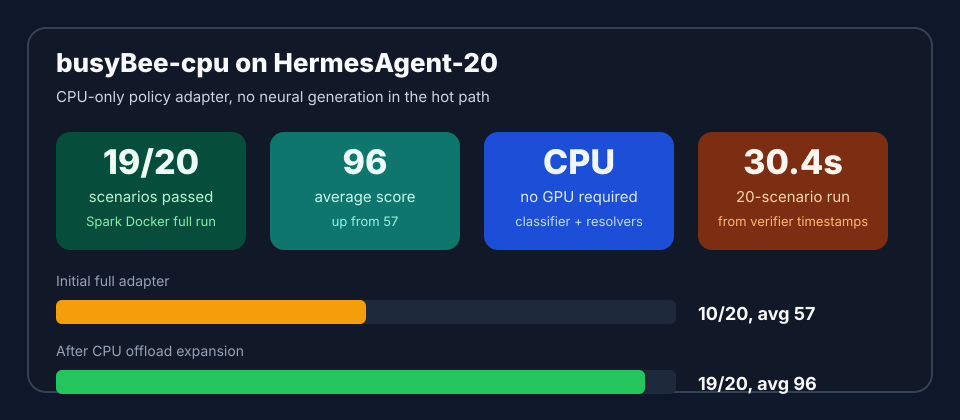
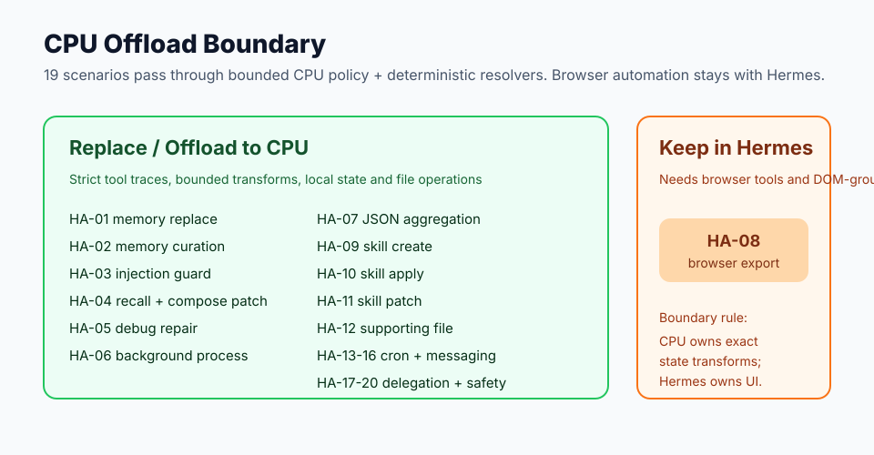

# busyBee-cpu

`busyBee-cpu` is a CPU-friendly, non-generative ML policy layer for structured action workflows.





## Current Result

Official Spark Docker validation against HermesAgent-20:

```text
completed=20 pass=19 partial=0 fail=1 averageScore=96
```

The CPU path now replaces or offloads 19 of 20 scenarios. The full 20-scenario verifier run took about `30.4s` from first scenario start to final scenario completion on the Spark CPU host. The remaining non-offloaded case is `HA-08 browser export`, which needs real browser login, navigation, DOM grounding, and export verification.

## HF Model Comparison

Public Hugging Face model cards currently show HermesAgent-20 scores for several 9B-class generative agent models. The comparison is useful, but not perfectly apples-to-apples: `busyBee-cpu` is a CPU policy/offload adapter with deterministic resolvers, while the listed models are general generative controllers.

| System | HermesAgent-20 score | Runtime shape | Source |
| --- | ---: | --- | --- |
| `busyBee-cpu` | `96` | CPU classifier + deterministic resolvers, no neural generation hot path | this repo, Spark Docker log |
| `Jackrong/Qwopus3.5-9B-Coder` | `85` | 9B generative model, LM Studio / MLX / GGUF on Apple Silicon | [HF card](https://huggingface.co/Jackrong/Qwopus3.5-9B-Coder) |
| `Qwen/Qwen3.5-9B` | `71` | 9B generative model baseline | [HF card](https://huggingface.co/Jackrong/Qwopus3.5-9B-Coder) |
| `armand0e/Qwen3.5-9B-Agent` | `68` | 9B agent-tuned generative model | [HF card](https://huggingface.co/Jackrong/Qwopus3.5-9B-Coder) |
| `DJLougen/Harmonic-Hermes-9B` | `47` | 9B Hermes-tuned generative model | [HF card](https://huggingface.co/Jackrong/Qwopus3.5-9B-Coder) |

The closest HF speed reference I found is the Qwopus MTP GGUF card, which reports token throughput improving from `4.94 tok/s` to `6.71 tok/s` for the generative model variant. `busyBee-cpu` is measured differently: it routes bounded actions and deterministic transforms on CPU, so the relevant number here is the full HermesAgent-20 wall-clock verifier pass, about `30.4s` for 20 scenarios. See [Qwopus3.5-9B-Coder-MTP-GGUF](https://huggingface.co/Jackrong/Qwopus3.5-9B-Coder-MTP-GGUF).

Newly offloaded from the original failed set:

- `HA-01`: contradictory memory replacement
- `HA-02`: near-capacity memory curation
- `HA-04`: session recall plus Docker compose patch
- `HA-07`: deterministic incident JSON aggregation
- `HA-09`: reusable skill creation
- `HA-10`: skill discover/view/apply
- `HA-11`: focused skill patch
- `HA-12`: supporting skill file write
- `HA-17`: batched delegation trace plus deterministic merge

Already passing before the expansion:

- `HA-03`: malicious memory injection guard
- `HA-05`: failing test repair
- `HA-06`: background process workflow
- `HA-13`: cron create
- `HA-14`: cron update
- `HA-15`: cron run/delivery
- `HA-16`: cross-platform message delivery
- `HA-18`: approval-gated destructive command
- `HA-19`: recovery/retry deploy
- `HA-20`: clarify destructive delete

It trains small supervised classifiers that answer:

1. Which action should run next?
2. Which argument template should be used?

Deterministic resolvers then fill concrete paths, commands, messages, schedules, and memory values from structured state. This keeps the learned part on CPU and avoids using an LLM to generate JSON.

## Row Format

Training and evaluation use JSONL rows:

```json
{
  "goal": "Inspect the failing source file.",
  "state": {
    "recent_observations": ["Traceback points to src/parser.py:42"],
    "policy_features": {
      "candidate_paths": ["src/parser.py"],
      "candidate_test_command": "python -m pytest -q tests/test_parser.py"
    }
  },
  "available_tools": [
    {"name": "read_file", "schema": {"path": "string"}},
    {"name": "run_tests", "schema": {"command": "string"}}
  ],
  "target_action": {"tool": "read_file", "args": {"path": "src/parser.py"}}
}
```

The old prompt-block format with `<|goal|>`, `<|state|>`, and `<|tools|>` is also accepted for migration, but the repo names and runtime APIs are generic.

## Train And Evaluate

```powershell
python scripts\train_policy.py `
  --train examples\train.jsonl `
  --eval examples\eval.jsonl `
  --model-out runs\policy.joblib `
  --report reports\policy.md
```

Or after installation:

```powershell
bee-train --train examples\train.jsonl --eval examples\eval.jsonl --model-out runs\policy.joblib
```

## Serve

```powershell
python scripts\serve_policy.py --model runs\policy.joblib --host 127.0.0.1 --port 8767
```

Endpoint:

- `GET /health`
- `GET /v1/models`
- `POST /v1/chat/completions`

The chat endpoint expects a message containing a JSON object with `goal`, `state`, and `available_tools`. It returns one strict JSON action in the assistant message.

## Hermes Integration

For HermesAgent-20, serve the trained Hermes policy on a Docker-reachable host port:

```powershell
python scripts\serve_policy.py --model runs\hermes_policy.joblib --host 0.0.0.0 --port 8767 --exposed-model busybee-cpu
```

Then run HermesAgent-20 with a policy-adapter label:

```powershell
cd C:\Users\basbe\Desktop\AI_Research\HermesAgent-20
npm run dev:run -- --scenario HA-05 --provider busybee-cpu --model busybee-cpu --provider-model busybee-cpu --label busyBee-cpu --base-url http://host.docker.internal:8767/v1 --auth-mode none
```

If Docker Desktop is unavailable, the direct installed-runtime smoke can still exercise the Hermes adapter branch:

```powershell
python scripts\test_hermes_direct.py --base-url http://127.0.0.1:8767/v1
```

Latest official Docker-backed Spark run:

- Initial adapter-focused slice: `5/5` passed, `averageScore=100` across HA-05, HA-06, HA-13, HA-18, and HA-20.
- Initial full HermesAgent-20: `completed=20 pass=10 partial=0 fail=10 averageScore=57`.
- After deterministic CPU offload expansion: `completed=20 pass=19 partial=0 fail=1 averageScore=96`.

This supports using `busyBee-cpu` as a targeted CPU offload layer for routing, cron/message delivery, recovery, simple debug repair, safety/approval flows, bounded memory curation, deterministic code aggregation, skill file operations, and delegation-result merging. Browser automation remains with the larger controller. See `reports/hermes_integration_report.md`.

Replacement scope is broken down scenario-by-scenario in `reports/hermes_replacement_scope.md`. Current estimate: `19/20` HermesAgent-20 scenarios can be replaced or offloaded by the CPU policy path, with browser automation better treated as larger-controller work.

The HermesAgent-20 repository is owned by another GitHub account, so the Hermes-side adapter patch is vendored here for application to that repo:

```powershell
cd C:\Users\basbe\Desktop\AI_Research\HermesAgent-20
git apply ..\busyBee-cpu\integrations\hermesagent20\busybee-cpu-adapter.patch
```

## Design

```text
state/action JSONL
  -> TF-IDF feature extractor
  -> CPU action classifier
  -> CPU argument-template classifier
  -> deterministic resolver
  -> schema/safety metrics
```

This repo is intended to be reusable across tool-policy tasks, not tied to one agent or benchmark.

## BusyBeaver Findings

The BusyBeaver CPU path was tested against the frozen BusyBeaver harness evals after adding deterministic grounding fixes for punctuation, schedule names, endpoint memory values, C# test paths, and `Traceback mentions ...` anchors.

Current findings:

- `frozen_path_grounding_v2`: correct tool `1.0000`, argument semantic `1.0000`, strict JSON `1.0000`, schema `1.0000`, unsafe command `0.0000`
- `frozen_harness_v1`: correct tool `1.0000`, argument semantic `1.0000`, strict JSON `1.0000`, schema `1.0000`, unsafe command `0.0000`
- Regression tests cover cron/message punctuation, cron-create defaults, endpoint memory copying, C# `.Tests` / `*Tests.cs` path selection, and traceback-anchor path grounding.

The practical product conclusion is that narrow tool-policy routing is better handled by this CPU classifier plus deterministic resolver than by a tiny generative model. The learned model selects the action and argument template; the resolver copies exact values from state.
