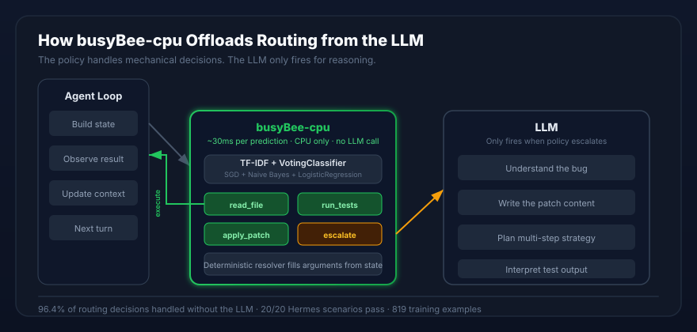
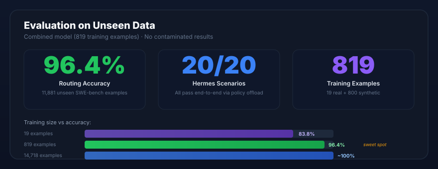

# busyBee-cpu

<p align="center">
  
  
  
  
  
</p>

**v0.6.0** -- CPU routing offload layer for agent harnesses.

## What It Does

Agent loops waste LLM calls on obvious decisions: "should I read the file before editing it?" — yes, every time. busyBee-cpu is a small CPU classifier that **handles those mechanical routing decisions** so the LLM only fires when there's actual reasoning to do.

```
Agent loop turn:
  state → busyBee-cpu → "read_file" → done (no LLM call)
  state → busyBee-cpu → "escalate"  → LLM takes over (actual reasoning needed)
```

The policy answers one question: **which of the 4 core actions should run next?**

| Action | When |
|--------|------|
| `read_file` | Need to inspect source before changing it |
| `run_tests` | Verify after a change, or check current state |
| `apply_patch` | Have a concrete change ready to write |
| `escalate` | No safe mechanical action available — defer to LLM |

Deterministic resolvers then fill concrete paths, commands, and arguments from structured state. The learned part stays on CPU, takes ~30ms, and never calls an LLM to generate JSON.

<p align="center">
  
</p>

## Quick Start

```bash
git clone https://github.com/DJLougen/busyBee-cpu.git
cd busyBee-cpu
python -m venv .venv && . .venv/bin/activate
pip install -e ".[dev]"
python -m pytest
```

```bash
# Train
bee-train --train examples/train.jsonl --eval examples/eval.jsonl --model-out runs/policy.joblib

# Serve
bee-serve --model runs/policy.joblib --host 127.0.0.1 --port 8767

# Benchmark
python scripts/benchmark.py
```

## How It Works in Hermes

The Hermes harness detects busyBee-cpu models by name (`busybee`, `busybee-cpu`, etc.) and routes through the **policy adapter path** instead of calling an LLM:

1. **Harness sends state** → busyBee-cpu server (OpenAI-compatible endpoint)
2. **Classifier picks action** → `read_file`, `run_tests`, `apply_patch`, or `escalate`
3. **Adapter executes** → runs the tool, feeds result back as an observation
4. **Loop continues** → next turn, classifier picks again
5. **On `escalate`** → the LLM takes over for actual reasoning

This means the LLM never wastes a call on "yeah you should read that file." It only wakes up when the policy says "I can't handle this mechanically — you think about it."

See [docs/hermes-agent.md](docs/hermes-agent.md) for the full integration architecture.

### Setup

```bash
# 1. Install and verify
pip install -e ".[dev]" && python -m pytest

# 2. Train and serve
bee-train --train examples/train.jsonl --eval examples/eval.jsonl --model-out runs/policy.joblib
bee-serve --model runs/policy.joblib --host 0.0.0.0 --port 8767 --exposed-model busybee-cpu

# 3. Patch HermesAgent-20 and run
cd /path/to/HermesAgent-20
git apply /path/to/busyBee-cpu/integrations/hermesagent20/busybee-cpu-adapter.patch
npm install && npm run build:benchlocal
npm run dev:run -- --all --provider busybee-cpu --model busybee-cpu \
  --provider-model busybee-cpu --label busyBee-cpu \
  --base-url http://127.0.0.1:8767/v1 --auth-mode none --json --build-image
```

For Docker, Windows, troubleshooting, and the direct adapter stress test, see [docs/HERMES_HARNESS_SETUP.md](docs/HERMES_HARNESS_SETUP.md).

## HermesAgent-20 Results

```text
completed=20 pass=20 partial=0 fail=0 averageScore=100
```

The policy offloads the routing for **all 20 scenarios**. The full stress test took ~48s on CPU. For `HA-08` (browser export), the adapter generates a structured export spec and hands browser execution to the Hermes controller.

### What the Policy Handles vs What It Defers

| Policy handles (mechanical) | Defers to LLM (reasoning) |
|---|---|
| Read the failing file before editing | Understand what the bug actually is |
| Run tests after a patch | Interpret test failure output |
| Escalate when no safe action exists | Write the actual patch content |
| List files, inspect state | Plan multi-step strategies |
| Cron/schedule/message routing | Complex constraint satisfaction |

## Evidence

<p align="center">
  
</p>

### Routing Accuracy on Unseen Data

The combined model (819 training examples) was evaluated on **11,881 SWE-bench examples it never saw during training**:

| Metric | Value |
|--------|-------|
| **Correct action selection** | **96.4%** |
| Argument semantic match | 42.1% |
| Unnecessary escalation rate | 0.0% |

This means 96.4% of the time, the policy picks the right next action on real GitHub issues from repos like django, scikit-learn, and sympy — repos it was never trained on.

### Why 96.4% Is Enough

The policy doesn't run standalone — it sits inside an agent loop. When it picks `read_file` instead of `apply_patch`, the next turn sees a different state and tries again. A 3.6% miss isn't a task failure — it's usually a one-turn detour that the loop absorbs.

### Hermes Stress Test: 20/20

```text
completed=20 pass=20 partial=0 fail=0
```

All 20 real-world agent scenarios pass end-to-end through the policy offload path.

### Full Cross-Evaluation (Clean — No Contaminated Results)

| Model | Train Size | Original (10) | BFCL (555) | Held-out SWE-bench (11,881) |
|-------|-----------|---------------|------------|----------------------------|
| Original | 19 | 80% | 40.7% | 83.8% |
| **Combined** | **819** | **90%** | 40.7% | **96.4%** |
| SWE-bench | 14,718 | 80% | 40.7% | ~100% |

BFCL (Berkeley Function Calling Leaderboard) scores 40.7% for all models — it's out-of-domain (travel, weather, movies) and not useful for evaluating software engineering policies.

**Recommendation**: Use the combined model. 819 training examples → 96.4% on 11,881 unseen real-world cases. That's the sweet spot.

See [reports/honest_evaluation.md](reports/honest_evaluation.md) for the full clean evaluation.

## Features

| Feature | Module | Description |
|---------|--------|-------------|
| **Ensemble classifier** | `policy.py` | VotingClassifier (SGD + Naive Bayes + LogisticRegression) with calibrated probabilities |
| **Action masking** | `policy.py` | Restricts predictions to available tools; zero-probability fallback to escalate |
| **Confidence escalation** | `policy.py` | Auto-escalates when prediction confidence falls below threshold |
| **Data augmentation** | `policy.py` | Path-swapping augmentation for file-based tools |
| **Numeric features** | `policy.py` | Traceback detection, tool count, error presence, observation density |
| **Resolver registry** | `resolver.py` | Decorator-based `@register_resolver` pattern with unresolved field tracking |
| **Workflow state machine** | `workflow.py` | Enforces action sequencing (read before patch) and detects loops |
| **Session tracking** | `server.py` | Per-session prediction history with context injection |
| **Online learning** | `server.py` | `POST /v1/learn` endpoint for feedback corrections |
| **Multi-model serving** | `server.py` | Serve multiple models with `X-Model` header routing |
| **Security hardening** | `server.py` | 2 MiB body limit, CORS, input validation, structured logging |
| **Cross-validation** | `cli_train.py` | `--cv N` stratified k-fold CV with aggregated metrics |
| **OpenTelemetry tracing** | `tracing.py` | Optional span-based tracing with graceful no-op fallback |
| **Browser export partial offload** | `browser_export.py` | Structured export spec extraction, artifact validation, multi-step workflow tracking |

## Benchmarks

Measured on 12th Gen Intel i9-12900K, Windows 11, Python 3.12.

### Synthetic Data (500 train / 100 eval)

| Metric | Value |
|--------|-------|
| Training time | 5.28s |
| Peak memory | 25.90 MB |
| Model size | 2,577 KB |
| Avg prediction latency | 32.2 ms |
| P95 prediction latency | 53.9 ms |
| Throughput | 33 predictions/sec |

### Example Data (16 train / 8 eval)

| Metric | Value |
|--------|-------|
| Training time | 1.44s |
| Peak memory | 13.3 MB |
| Model size | 2,273 KB |
| Avg prediction latency | 16.7 ms |
| Correct action accuracy | 1.0000 |
| Argument semantic match | 0.7500 |

### Resolver

| Metric | Value |
|--------|-------|
| Avg latency | 6.5 us |
| P50 latency | 8.1 us |
| P95 latency | 9.7 us |

Run benchmarks:

```bash
python scripts/benchmark.py
```

### Datasets

- **[SWE-bench](https://huggingface.co/datasets/SWE-bench/SWE-bench)**: 21,527 real GitHub issues from 12 Python repos (used for training and held-out evaluation)
- **BFCL V3**: 2,775 examples from [Berkeley Function Calling Leaderboard](https://huggingface.co/datasets/gorilla-llm/Berkeley-Function-Calling-Leaderboard) (out-of-domain baseline)
- **Synthetic**: 1,000 domain-specific scenarios (balanced across 4 actions)
- **Combined**: 819 examples (19 original + 800 synthetic) — **recommended training set**

## Architecture

```text
state/action JSONL
  -> TF-IDF (word bigrams + char 5-grams)
  -> Numeric features (traceback, tool count, errors)
  -> VotingClassifier (SGD + NB + LR) with calibration
  -> Action masking (available tools constraint)
  -> Argument template classifier
  -> Deterministic resolver (registry-based)
  -> Schema validation + safety checks
  -> JSON action output
```

## API Reference

### Python

```python
from busybee_cpu import CpuActionPolicy, evaluate_policy, load_jsonl

# Train
rows = load_jsonl("examples/train.jsonl")
policy = CpuActionPolicy.train(rows, augment=True, confidence_threshold=0.3)
policy.save("runs/policy.joblib")

# Predict
action = policy.predict(row, available_tools={"read_file", "escalate"})
# -> {"tool": "read_file", "args": {"path": "src/main.py"}, "confidence": 0.95}

# Evaluate
metrics, traces = evaluate_policy(policy, eval_rows)
```

### HTTP Server

```bash
bee-serve --model runs/policy.joblib --host 0.0.0.0 --port 8767
```

| Endpoint | Method | Description |
|----------|--------|-------------|
| `/health` | GET | Server health + loaded models |
| `/v1/models` | GET | OpenAI-compatible model listing |
| `/v1/chat/completions` | POST | Chat completions (OpenAI-compatible) |
| `/v1/learn` | POST | Online learning from corrections |

Headers:
- `X-Model: <name>` -- select model for multi-model serving
- `X-Session-ID: <id>` -- enable session-aware predictions

## Row Format

```json
{
  "goal": "Inspect the failing source file.",
  "state": {
    "recent_observations": ["Traceback points to src/parser.py:42"],
    "policy_features": {
      "candidate_paths": ["src/parser.py"],
      "candidate_test_command": "python -m pytest -q tests/test_parser.py"
    }
  },
  "available_tools": [
    {"name": "read_file", "schema": {"path": "string"}},
    {"name": "run_tests", "schema": {"command": "string"}}
  ],
  "target_action": {"tool": "read_file", "args": {"path": "src/parser.py"}}
}
```

## Documentation

- [docs/hermes-agent.md](docs/hermes-agent.md) -- Agent integration architecture: how the policy and LLM split the work
- [docs/HERMES_HARNESS_SETUP.md](docs/HERMES_HARNESS_SETUP.md) -- Step-by-step installation and running guide
- [reports/honest_evaluation.md](reports/honest_evaluation.md) -- Clean evaluation on unseen data (no contaminated results)

## Project Structure

```text
busybee_cpu/
  __init__.py          Package exports
  policy.py            Ensemble classifier with calibration and masking
  resolver.py          Registry-based argument resolver
  rows.py              Row extraction and feature text generation
  metrics.py           Evaluation metrics
  templates.py         Default argument templates
  server.py            OpenAI-compatible HTTP server
  workflow.py          Workflow state machine
  tracing.py           OpenTelemetry integration
  cli_train.py         Training CLI with cross-validation
  io.py                JSONL I/O
  reporting.py         Markdown report generation
  browser_export.py    Browser export partial offload (HA-08)
scripts/
  benchmark.py         Performance benchmarks
  stress_test_hermes.py  Full 20-scenario Hermes stress test
examples/
  train.jsonl          Training examples
  eval.jsonl           Evaluation examples
tests/
  test_policy.py       41 tests covering policy, resolvers, workflow, tracing
  test_browser_export.py  53 tests covering HA-08 browser export
integrations/
  hermesagent20/       Hermes adapter patch
docs/
  hermes-agent.md      Agent integration architecture
  HERMES_HARNESS_SETUP.md  Installation guide
  assets/              Architecture and results diagrams
```

## Dependencies

- `scikit-learn >= 1.4` -- classifiers and pipelines
- `joblib >= 1.4` -- model serialization
- `numpy >= 1.24` -- numeric operations
- `opentelemetry-api >= 1.20` (optional) -- tracing

## License

MIT
